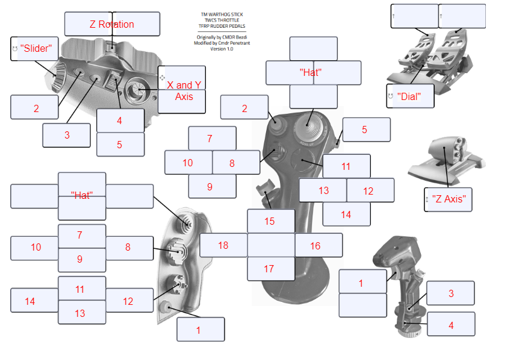
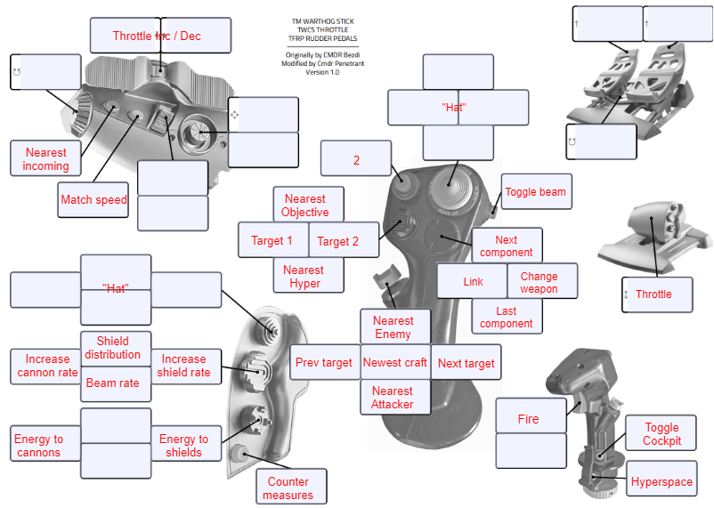

# Configurations provided for this joystick

1. `TieFighterWarthog-and-TWCS-Gremlin-profile.xml`

# How To Load the Profile

## Intro

The profile (xml) file in this folder is a Joystick Gremlin configuration file.  It maps the Thrustmaster Warthog and Thrustmaster TWCS controllers for X-Wing Alliance / Tie Fighter.

## Files

- TieFighterWarthog-and-TWCS-Gremlin-profile.xml - the actual profile to be loaded.
- Joystick_Gremlin_Warthog_Template.png - a template file that shows how Joystick Gremlin enumerates the buttons and axes used by these controllers.
- Tie_Fighter_Warthog_and_TWCS_Mapping_Diagram.png - a handy diagram showing all the axis and button mappings configured in this profile.

## Pre-Requisites

To use a Joystick Gremlin profile, it is assumed that you have done the following:
1. Performed the **one-time installation of the [vJoy](https://sourceforge.net/projects/vjoystick/) virtual device.**  This is a utility which creates a new 'virtual' game controller.
2. Performed the **one-time installation of [Joystick Gremlin](https://whitemagic.github.io/JoystickGremlin/).** This is a vendor-agnostic open source utility that allows configuration of any controllers, and presents the configuration through the vJoy virtual device.

## Using the Profile

1. Launch Joystick Gremlin.
2. Load the profile, i.e. the xml file.
3. 'Activate' the profile in Joystick Gremlin.
4. Launch X-Wing Alliance
5. In 'Game Controller Settings', select the vJoy Device.  (You only need to do this once.)

## Template and Mapping Diagram

