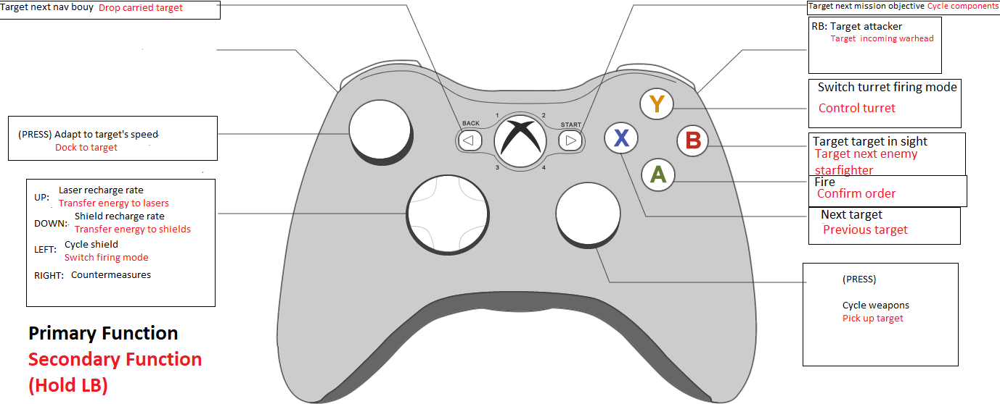

This binding uses AutoHotkey (https://www.autohotkey.com/).

Double-click AllianceAutoHotkey-XBOX360.ahk and open it with AutoHotkey.
In your system tray, a small green symbol with a white "H" will appear. You can now start the game.

Most buttons have a secondary funtion accessed by holding LB on your controller.

You need to go to the Joystick Configurator in the XWA Upgrade launcher and make sure it uses the XBox controller. Here, you must also set up the axis. Use the triggers on your controller as the throttle axis; you probably need to invert the axis.

