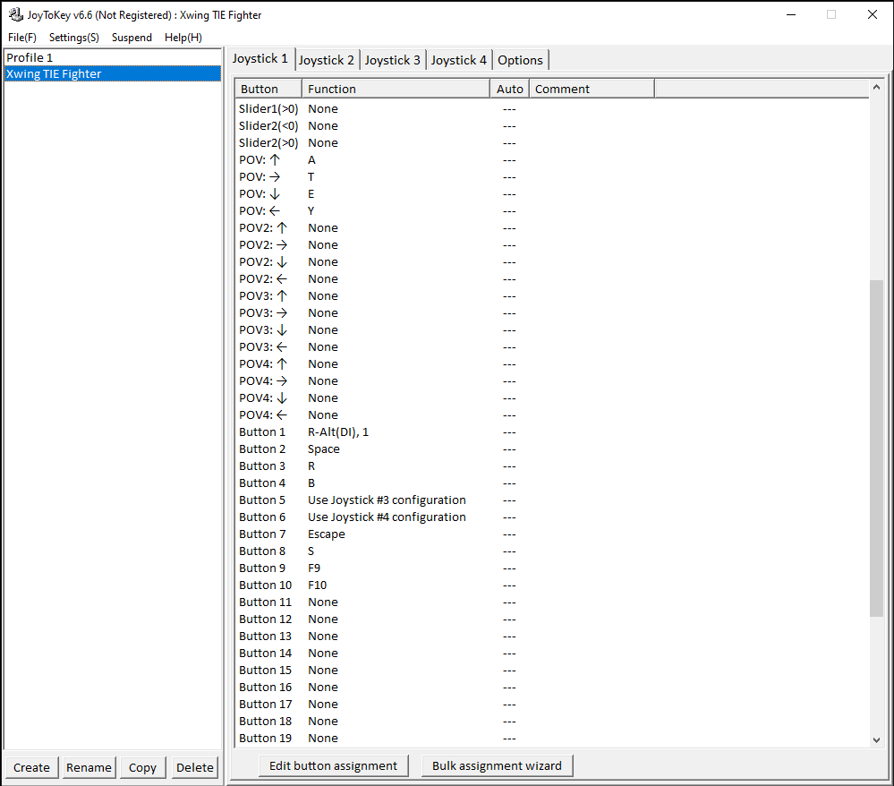
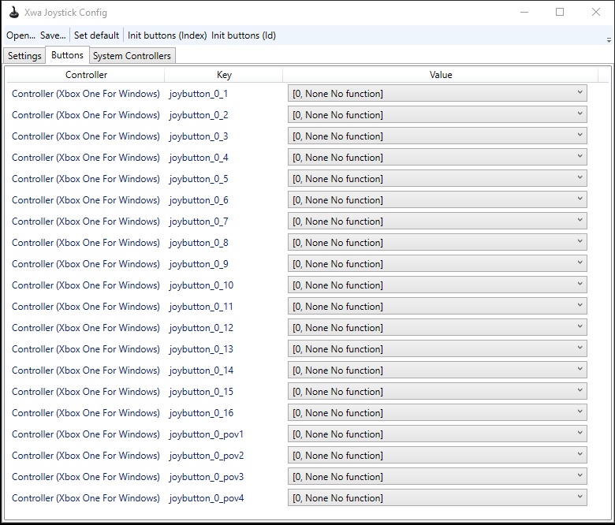

# Why use Joytokey?

Unfortunately, `Xwa Joystick Configurator` has limited functionality to configure your gamepad for advanced use cases. If you'd like use triggers as buttons (eg. to fire weapons) or switch to alternative layouts based on a button press, you'll need to disable assignments in the configurator and override them with a more advanced mapping application. I described usage of Joytokey below, but any other app can be used in that fashion. 

# How to setup Joytokey for TFTC

1. Download and install [JoyToKey](https://joytokey.net/en/download). JoyToKey is a shareware application which you can freely download and evaluate without any limitation in functionality.
2. Copy the `Xwing_TIE_Fighter.cfg` file to your Joytokey profile folder, which should be `C:\Users\your-user-name\Documents\JoyToKey` by default. Once copied, it should be listed within the profile list on the left as shown below.

3. Open up your `Xwa Joystick Configurator` and set your buttons to `[0, None No function]` and the Throttle axis to 5. The idea here is to nullify Xwa's own joystick configuration and override it with Joytokey instead. Setting the Throttle axis to a non-valid axis index will effectively disable it. You can also use the `JoystickConfig.txt` listed here, simply using the `Open...` menu and saving over your configuration.

4. Keep the Joytokey application open and start the game.

## Xbox Gamepad button - key mapping

| Gamepad                              | Key                 | Functionality           |
|:-------------                        |:--------            |:------                  |
| Button - A                           | Alt-1               | Pick target in sight    |
| Button - B                           | Space               | Confirm critical orders |
| Button - X                           | R                   | Target nearest fighter  |
| Button - Y                           | B                   | Beam weapon on/off      |
| Left Stick - Left                    | Managed by XWa      | Yaw Left                |
| Left Stick - Right                   | Managed by XWa      | Yaw Right               |
| Left Stick - Up                      | Managed by XWa      | Pitch Down              |
| Left Stick - Down                    | Managed by XWa      | Pitch Up                |
| Right Stick - Left                   | Managed by XWa      | Roll Left               |
| Right Stick - Right                  | Managed by XWa      | Roll Right              |
| Left Bumper (L1)                     | - (Minus)           | Decrease throttle       |
| Right Bumper (R1)                    | = (Equal)           | Increase throttle       |
| Left Bumper (L1) + Right Bumper (R1) | Enter               | Match targeted craft's speed |
| Left Stick (L3)                      | F9                  | Adjust laser recharge rate   |
| Right Stick (R3)                     | F10                 | Adjust shield recharge rate  |
| Left Trigger (L2)                    | -                   | Hold to activate secondary layout. (See below: L2 + ...) |
| Right Trigger (R2)                   | Alt-2               | Fire weapon. (10 times per second) |
| D Button - Left                      | Y                   | Previous target            |
| D Button - Right                     | T                   | Next target                |
| D Button - Up                        | A                   | Target attacker of target  |
| D Button - Down                      | E                   | Cycle through fighters targetting you |
| Back                                 | Escape              | Options screen                    |
| Select                               | S                   | Cycle shield settings             |
| L2 + Button - A                      | O                   | Target nearest objective craft    |
| L2 + Button - B                      | Shift S             | Call for reinforcements |
| L2 + Button - X                      | C                   | Fire countermeasure  |
| L2 + Button - Y                      | H                   | Restart mission      |
| L2 + Left Bumper                     | \ (Backslash)       | Zero throttle         |
| L2 + Right Bumper                    | Backspace           | Full throttle        |
| L2 + D Button Left                   | Shift , (Comma)     | Reverse cycle through targets components |
| L2 + D Button Right                  | , (Comma)           | Cycle through targets components |
| L2 + D Button Up                     | W                   | Cycle weapon settings |
| L2 + D Button Down                   | X                   | Cycle firing settings |
| L2 + Left stick (L3)                 | ; (Semicolon)       | Transfer shield energy to lasers |
| L2 + Right stick (R3)                | ' (Apostrophe)      | Transfer laser energy to shields |
| L2 + Back                            | F8                  | Adjust beam recharge rate |
| L2 + Select                          | Z                   | Toggle laser convergence |
| L2 + Right Stick - Up                | Shift A             | Assign target to wingmen     |
| L2 + Right Stick - Down              | Shift C             | Order wingmen to cover you   |