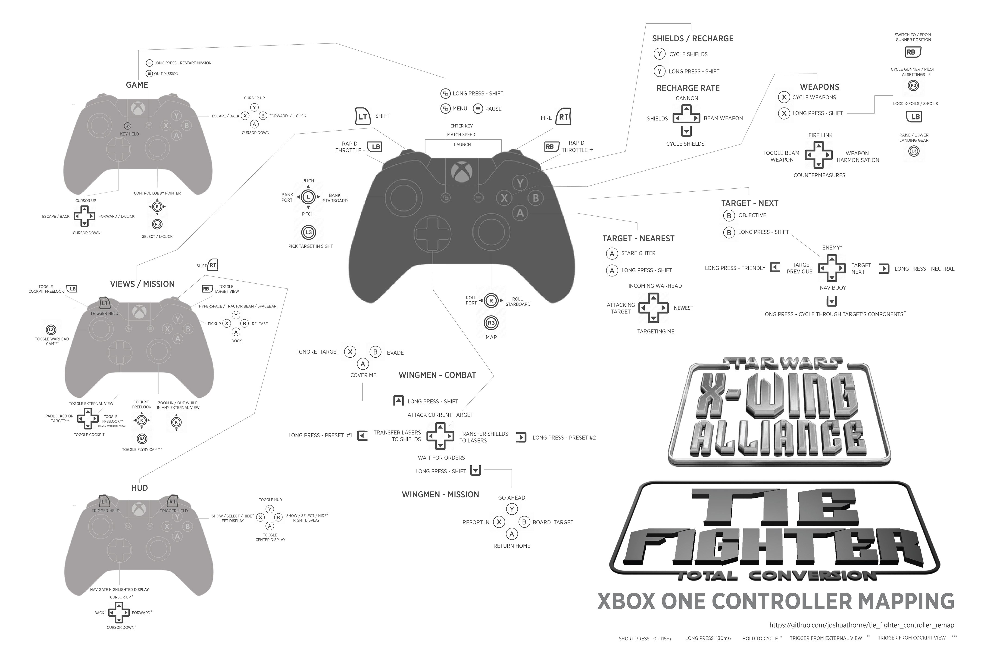

# X-Wing Alliance / TIE-Fighter Total Conversion
## XBOX One Controller mapping
JoyToKey profile that maps nearly the full command-set to the XBOX One controller

Includes most commands for: 
- Weapons
- Power Allocation
- Recharge Allocation
- Mission Commands
- Targeting
- Wingman Commands
- View Modes
- HUD Interactions
- Lobby Controls

Some commands have been streamlined. For instance all the different throttle commands have been reduced to throttle+ / throttle-, but with a throttle rate rapid enough to make the more granular commands unnecessary.

The only functionality totally left out is multiplayer communication, and targeting presets.

## Short Press / Long Press
Each short-press button is mapped to a virtual button, JoyToKey calls them **Button Aliases**. When the physical button is pressed, the aliased button is triggered simultaneously.  

The physical button will send an input if released within 0-115ms. At 130ms, the aliased button becomes active and applies a specified remap from one of the 10 Joystick configs. 

To get the best results, be quick and snappy with your short-presses to ensure they come in within the 115ms window. The window is on the short-side to allow for fast remap access while in combat.

## Layout
The key to this layout is the command groupings. Commands are categorized into small logical groups. If you can remember the groups, and what their root buttons are, you'll be able to intuitively find your way around the controller.

The groups are:
- A - Target-Nearest
- B - Target-Next
- X - Weapons
- Y - Shields/Recharge
- D-Up - Wingmen-Combat
- D-Down - Wingmen-Mission
- D-Left/Right - Power
- LT - Views/Mission
- LT + RT - HUD
- Select - Game

## Installation
1. Copy the `JoystickConfig.txt` file to the root of your `X-Wing Alliance` folder. Overwrite the file if it exists.
3. Install [JoyToKey](https://joytokey.net/en/).
4. Place the `XWing_TFTC_Controls.cfg` in the JoyToKey info folder. Usually `USER/Documents/JoyToKey`
4. Set `JoyToKey.exe` to run as admin, otherwise it won't take control of the game window.
5. Run JoyToKey and Select the XWing_TFTC_Controls profile, or set the profile to apply automatically when running XwingAlliance.exe
6. In the Game menu, set **Enable Rudder** to **no**
7. Enjoy

https://github.com/joshuathorne
