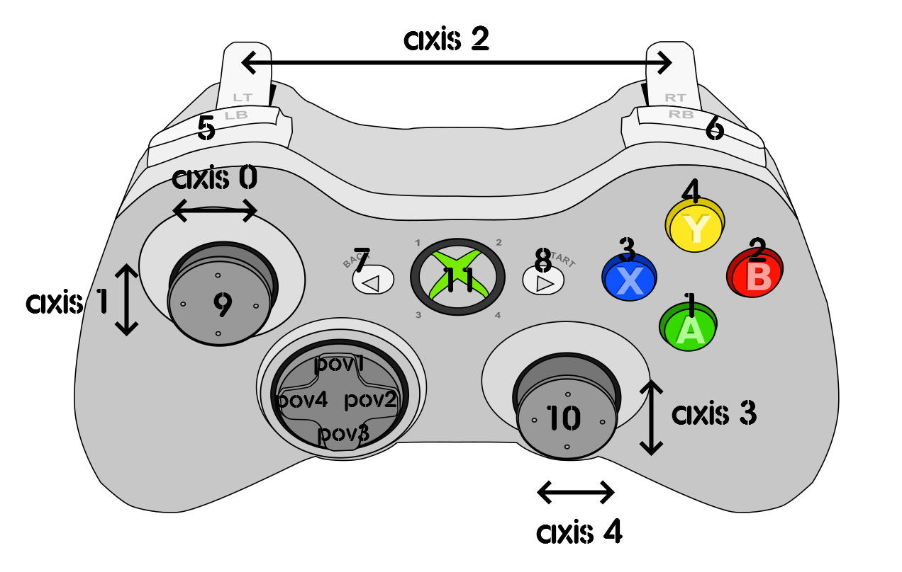

# Configurations provided for this joystick

1. `Advanced_Config_with_JoytoKey` - submitted by aveferrum

An advanced configuration using both XWA Joystick configurator and Joytokey. Check the folder contents for more details.

2. `Comprehensive_Config_with_Joytokey` - submited by [joshuathorne](https://github.com/joshuathorne)

An comprehensive configuration using both XWA Joystick configurator and Joytokey. It's a JoyToKey profile that uses short-press / long-hold / shift keys / Button Repeats, to include almost the entire command list (minus multiplayer communication.)
You have full view mode control, HUD interaction, lobby controls, etc. All a press or a hold away. Check the folder contents for more details.

3. `JoystickConfig.txt` 

A basic configuration for XBox One controller.

